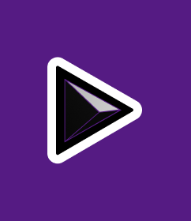

# PODPLAYR 🎵

<div align="center">
  
</div>

A modern web3-enabled media player for NFT audio content, built with Next.js and blockchain technology. PODPLAYR allows users to play and manage their NFT audio content with a sleek, user-friendly interface while leveraging blockchain technology for ownership verification.

## ✨ Features

- **NFT Audio Playback**
  - Seamless playback of NFT audio content
  - Support for various audio formats
  - Progress tracking and duration display
  - Minimizable player interface

- **Web3 Integration**
  - Secure wallet connection using Wagmi
  - NFT ownership verification
  - Base network support
  - Farcaster social features integration

- **User Experience**
  - Beautiful, responsive UI built with Tailwind CSS
  - User profile system with search functionality
  - Intuitive audio player controls
  - Real-time progress tracking
  - Mobile-friendly design

## 🛠 Tech Stack

- **Frontend Framework**: 
  - Next.js 15.0.3
  - React 18.2.0
  - TypeScript

- **Styling**: 
  - Tailwind CSS
  - PostCSS
  - Heroicons for UI elements

- **Web3 Integration**: 
  - Wagmi/Core for wallet connection
  - Viem for blockchain interactions
  - Farcaster Frame SDK for social features
  - Alchemy SDK for NFT data

- **State Management**: 
  - React Query (Tanstack Query)
  - React Virtual for efficient list rendering

- **Backend & Storage**:
  - Firebase/Firestore for database
  - Upstash Redis for caching
  - Next.js API routes

## 📋 Prerequisites

- Node.js (^18.18 or >=20)
- Yarn package manager (v4.1.1)
- A modern web browser with Web3 capabilities
- Environment variables configuration

## 🔧 Environment Setup

1. Create a `.env` file in the root directory
2. Add the following variables:

```env
# Blockchain & Web3
NEXT_PUBLIC_ALCHEMY_API_KEY=     # Your Alchemy API key
NEXT_PUBLIC_NEYNAR_API_KEY=      # Your Neynar API key for Farcaster

# Application URLs
NEXT_PUBLIC_HOST=                # Your application host
NEXT_PUBLIC_NGROK_URL=           # Ngrok URL (for development)
NEXT_PUBLIC_URL=                 # Public URL

# Firebase Configuration
NEXT_PUBLIC_FIREBASE_API_KEY=    # Firebase API key
NEXT_PUBLIC_FIREBASE_AUTH_DOMAIN=
NEXT_PUBLIC_FIREBASE_PROJECT_ID=
NEXT_PUBLIC_FIREBASE_STORAGE_BUCKET=
NEXT_PUBLIC_FIREBASE_MESSAGING_SENDER_ID=
NEXT_PUBLIC_FIREBASE_APP_ID=

# Key-Value Store
KV_REST_API_URL=                 # Upstash Redis URL
KV_REST_API_TOKEN=               # Upstash Redis token
```

## 🚀 Getting Started

### Installation

1. Clone the repository:
   ```bash
   git clone https://github.com/MisterGoldie/podplyr-frames-v2-demo-main-2-main
   cd podplyr
   ```

2. Install dependencies:
   ```bash
   yarn install
   ```

3. Set up environment variables as described above

### Development

Start the development server:
```bash
yarn dev
```
Visit [http://localhost:3002](http://localhost:3001) in your browser.

### Production Build

Build and start the production server:
```bash
yarn build
yarn start
```

### Code Quality

Run linting:
```bash
yarn lint
```

## 📁 Project Structure

```
podplyr/
├── src/
│   ├── app/           # Next.js app router and layouts
│   ├── components/    # React components
│   │   ├── providers/ # Context providers
│   │   └── Demo.tsx   # Main application component
│   ├── lib/          # Utility functions and configs
│   └── types/        # TypeScript type definitions
├── public/           # Static assets
└── [Config Files]    # Various configuration files
```

## 🤝 Contributing

We welcome contributions! Here's how you can help:

1. Fork the repository
2. Create your feature branch (`git checkout -b feature/AmazingFeature`)
3. Commit your changes (`git commit -m 'Add some AmazingFeature'`)
4. Push to the branch (`git push origin feature/AmazingFeature`)
5. Open a Pull Request

Please ensure your PR follows our coding standards and includes appropriate tests.

## 📝 License

This project is licensed under the MIT License - see the [LICENSE](LICENSE) file for details.

## 🙏 Acknowledgments

- Built with [Next.js](https://nextjs.org/)
- Web3 integration powered by [Wagmi](https://wagmi.sh/)
- Social features by [Farcaster](https://www.farcaster.xyz/)
- Built Primarily by [MisterGoldie](https://github.com/MisterGoldie) at /thepod
